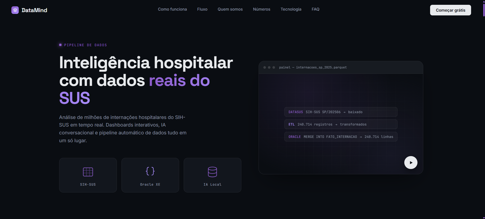
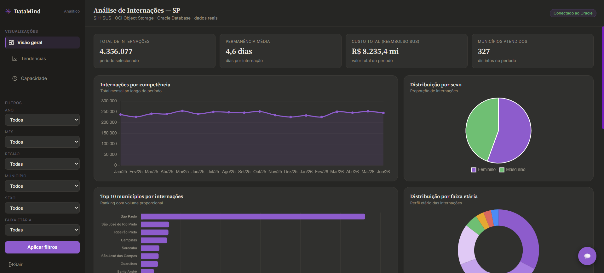

# DataMind — Painel Inteligente de Internações Hospitalares

Plataforma de análise de dados hospitalares do SUS com dashboards interativos, IA conversacional local e pipeline automático de dados. Projeto acadêmico FIAP · Modern Data Architecture & Engineering.

**Acesso online:** [http://132.226.165.94:8001/landing](http://132.226.165.94:8001/landing)



---

## O que é

Três perfis de usuário, três formas de consumir a mesma base de dados reais do SIH-SUS:

| Perfil | O que faz |
|---|---|
| **Executivo** | Dashboard financeiro com KPIs, custo por hospital, ranking e relatórios em PDF/CSV |
| **Analítico** | 6 gráficos interativos com filtros por ano, mês, sexo, faixa etária e município |
| **Conversacional** | IA local que responde perguntas sobre os dados em linguagem natural, sem internet |

---

## Fontes de dados

| Dado | Fonte | Script |
|---|---|---|
| Municípios | IBGE API | `load_dim_municipio.py` |
| Hospitais | CNES / DEMAS | `load_dim_hospital.py` |
| Procedimentos | SIGTAP | `load_dim_procedimento.py` |
| Internações | SIH-SUS via pysus | `sync_sih_sus_multi.py` |

**Dados carregados:** SP · 2025 e 2026 · ~4,5 milhões de internações

---



## Arquitetura

```
ORACLExDATASUS_challenge-FIAP-2026/
├── app/                            ← IA conversacional (FastAPI + GGUF)
│   ├── main.py
│   ├── llm.py                      ← modelo local + roteador de intenção
│   ├── rag.py                      ← indexação TF-IDF
│   └── plots.py
├── static/                         ← frontend da IA (chat)
├── painel-executivo-hospitalar/    ← backend + todos os dashboards
│   ├── main.py                     ← FastAPI porta 8001
│   ├── landing.html
│   ├── painel-executivo-hospitalar.html
│   ├── painel-analitico-hospitalar.html
│   ├── painel-comparativos.html
│   ├── painel-relatorios.html
│   ├── painel-tendencias.html
│   ├── painel-capacidade.html
│   └── 404.html
└── painel-hospitalar-sus/          ← pipeline ETL
    ├── sync_sih_sus_multi.py       ← extração multi-estado/ano
    ├── load_dim_municipio.py
    ├── load_dim_hospital.py
    └── load_dim_procedimento.py
```

**Banco:** Oracle 23ai Free · esquema estrela · `FATO_INTERNACAO` + 3 dimensões + 6 Materialized Views

---

## Pré-requisitos

- Python 3.12+
- Oracle XE 21c ou 23ai ([download gratuito](https://www.oracle.com/database/technologies/xe-downloads.html))
- 8GB RAM (mínimo para rodar a IA local)
- Git

---

## Como rodar localmente

### 1. Clonar e configurar

```bash
git clone https://github.com/mateus-henriquee/ORACLExDATASUS_challenge-FIAP-2026.git
cd ORACLExDATASUS_challenge-FIAP-2026
```

Crie o `.env` em cada pasta (`painel-executivo-hospitalar/`, `painel-hospitalar-sus/`, `app/`):

```env
ORACLE_USER=painel_hospitalar
ORACLE_PASSWORD=sua_senha
ORACLE_DSN=localhost:1521/XEPDB1
OCI_PAR_URL=               # opcional — para upload ao Data Lake
```

### 2. Instalar dependências

```bash
python -m venv venv
source venv/Scripts/activate   # Windows
pip install fastapi uvicorn oracledb pandas pysus python-dotenv requests scikit-learn matplotlib llama-cpp-python
```

### 3. Criar o schema no Oracle

Conecte com o usuário `painel_hospitalar` e rode:

```sql
-- Tabelas principais
CREATE TABLE DIM_MUNICIPIO (COD_IBGE NUMBER(6) PRIMARY KEY, NOME VARCHAR2(100), UF VARCHAR2(2), REGIAO VARCHAR2(20));
CREATE TABLE DIM_HOSPITAL (COD_CNES NUMBER(7) PRIMARY KEY, NOME VARCHAR2(200), COD_IBGE NUMBER(6), FAZ_ATENDIMENTO_SUS VARCHAR2(3), POSSUI_ATEND_HOSPITALAR NUMBER(1) DEFAULT 0);
CREATE TABLE DIM_PROCEDIMENTO (COD_PROCEDIMENTO VARCHAR2(10) PRIMARY KEY, DESCRICAO VARCHAR2(300), GRUPO VARCHAR2(100));
CREATE TABLE FATO_INTERNACAO (ID NUMBER GENERATED ALWAYS AS IDENTITY PRIMARY KEY, COD_CNES NUMBER(7), COD_IBGE NUMBER(6), COD_PROCEDIMENTO VARCHAR2(10), COMPETENCIA VARCHAR2(6), DATA_INTERNACAO DATE, DATA_SAIDA DATE, DIAS_PERMANENCIA NUMBER(5), VALOR_TOTAL NUMBER(12,2), FAIXA_ETARIA VARCHAR2(10), SEXO CHAR(1), CARATER_INTERNACAO VARCHAR2(2), AIH_ORIGINAL VARCHAR2(20));
CREATE TABLE STG_INTERNACAO (AIH_ORIGINAL VARCHAR2(20), COD_CNES NUMBER(7), COD_IBGE NUMBER(6), COD_PROCEDIMENTO VARCHAR2(10), COMPETENCIA VARCHAR2(6), DATA_INTERNACAO DATE, DATA_SAIDA DATE, DIAS_PERMANENCIA NUMBER(5), VALOR_TOTAL NUMBER(12,2), SEXO CHAR(1), CARATER_INTERNACAO VARCHAR2(2), FAIXA_ETARIA VARCHAR2(10));
CREATE TABLE SYNC_LOG (ID NUMBER GENERATED ALWAYS AS IDENTITY PRIMARY KEY, SISTEMA VARCHAR2(20), UF VARCHAR2(2), COMPETENCIA VARCHAR2(6), STATUS VARCHAR2(10), LINHAS_PROCESSADAS NUMBER, MENSAGEM VARCHAR2(500), DT_SYNC TIMESTAMP DEFAULT CURRENT_TIMESTAMP);

-- Índices
CREATE INDEX IDX_FATO_COMPETENCIA ON FATO_INTERNACAO(COMPETENCIA);
CREATE INDEX IDX_FATO_SEXO ON FATO_INTERNACAO(SEXO);
CREATE INDEX IDX_FATO_FAIXA ON FATO_INTERNACAO(FAIXA_ETARIA);
CREATE INDEX IDX_MUN_UF ON DIM_MUNICIPIO(UF);
COMMIT;
```

### 4. Carregar os dados

```bash
cd painel-hospitalar-sus
python load_dim_municipio.py      # ~1 min
python load_dim_hospital.py       # ~30 min
python load_dim_procedimento.py   # ~1 min
python sync_sih_sus_multi.py      # ~2-4h (baixa do DATASUS)
```

### 5. Criar as Materialized Views

```sql
CREATE MATERIALIZED VIEW MV_MUNICIPIO BUILD IMMEDIATE REFRESH COMPLETE ON DEMAND AS
SELECT m.NOME AS MUNICIPIO, COUNT(*) AS INTERNACOES, SUM(f.VALOR_TOTAL) AS CUSTO_TOTAL, AVG(f.VALOR_TOTAL) AS CUSTO_MEDIO, AVG(f.DIAS_PERMANENCIA) AS PERM_MEDIA FROM FATO_INTERNACAO f JOIN DIM_MUNICIPIO m ON f.COD_IBGE = m.COD_IBGE GROUP BY m.NOME;

CREATE MATERIALIZED VIEW MV_COMPETENCIA BUILD IMMEDIATE REFRESH COMPLETE ON DEMAND AS
SELECT f.COMPETENCIA, COUNT(*) AS INTERNACOES, SUM(f.VALOR_TOTAL) AS CUSTO_TOTAL, AVG(f.VALOR_TOTAL) AS CUSTO_MEDIO, AVG(f.DIAS_PERMANENCIA) AS PERM_MEDIA FROM FATO_INTERNACAO f GROUP BY f.COMPETENCIA ORDER BY f.COMPETENCIA;

CREATE MATERIALIZED VIEW MV_FAIXA_ETARIA BUILD IMMEDIATE REFRESH COMPLETE ON DEMAND AS
SELECT f.FAIXA_ETARIA, COUNT(*) AS INTERNACOES, SUM(f.VALOR_TOTAL) AS CUSTO_TOTAL, AVG(f.VALOR_TOTAL) AS CUSTO_MEDIO, AVG(f.DIAS_PERMANENCIA) AS PERM_MEDIA FROM FATO_INTERNACAO f WHERE f.FAIXA_ETARIA IS NOT NULL GROUP BY f.FAIXA_ETARIA;

CREATE MATERIALIZED VIEW MV_SEXO BUILD IMMEDIATE REFRESH COMPLETE ON DEMAND AS
SELECT f.SEXO, COUNT(*) AS INTERNACOES, SUM(f.VALOR_TOTAL) AS CUSTO_TOTAL, AVG(f.DIAS_PERMANENCIA) AS PERM_MEDIA FROM FATO_INTERNACAO f WHERE f.SEXO IN ('M','F') GROUP BY f.SEXO;

CREATE MATERIALIZED VIEW MV_HOSPITAL BUILD IMMEDIATE REFRESH COMPLETE ON DEMAND AS
SELECT h.NOME AS HOSPITAL, m.NOME AS MUNICIPIO, COUNT(*) AS INTERNACOES, SUM(f.VALOR_TOTAL) AS CUSTO_TOTAL, AVG(f.VALOR_TOTAL) AS CUSTO_MEDIO, AVG(f.DIAS_PERMANENCIA) AS PERM_MEDIA FROM FATO_INTERNACAO f JOIN DIM_HOSPITAL h ON f.COD_CNES = h.COD_CNES JOIN DIM_MUNICIPIO m ON f.COD_IBGE = m.COD_IBGE GROUP BY h.NOME, m.NOME;

CREATE MATERIALIZED VIEW MV_KPIS BUILD IMMEDIATE REFRESH COMPLETE ON DEMAND AS
SELECT COUNT(*) AS TOTAL_INTERNACOES, SUM(f.VALOR_TOTAL) AS CUSTO_TOTAL, AVG(f.VALOR_TOTAL) AS CUSTO_MEDIO, AVG(f.DIAS_PERMANENCIA) AS PERM_MEDIA, COUNT(DISTINCT f.COD_IBGE) AS MUNICIPIOS_DISTINTOS, COUNT(DISTINCT f.COD_CNES) AS HOSPITAIS_DISTINTOS, MIN(f.COMPETENCIA) AS COMP_INICIO, MAX(f.COMPETENCIA) AS COMP_FIM FROM FATO_INTERNACAO f;

COMMIT;
```

### 6. Rodar os serviços

**Backend (porta 8001):**
```bash
cd painel-executivo-hospitalar
uvicorn main:app --host 0.0.0.0 --port 8001
```

**IA conversacional (porta 8000):**

Baixe o modelo GGUF ([Qwen2.5-3B-Instruct-Q4_K_M](https://huggingface.co/Qwen/Qwen2.5-3B-Instruct-GGUF)) e salve em `local-ia-rag/models/`.

```bash
cd local-ia-rag
python -m uvicorn app.main:app --host 0.0.0.0 --port 8000
```

Acesse: `http://localhost:8001/landing`

---

## Usuários de demonstração

| Email | Senha | Perfil |
|---|---|---|
| `mateus@datamind.com` | `admin123` | Executivo |
| `analista@datamind.com` | `analista123` | Analítico |
| `leigo@datamind.com` | `leigo123` | Conversacional |

---

## Stack

| Camada | Tecnologia |
|---|---|
| Banco | Oracle 23ai Free + Materialized Views |
| ETL | Python, pysus, pandas, oracledb |
| Data Lake | OCI Object Storage (parquet) |
| Backend | FastAPI |
| IA | llama-cpp-python + GGUF local |
| RAG | TF-IDF (scikit-learn) |
| Frontend | HTML/CSS/JS + Chart.js |
| Hospedagem | Oracle Cloud (VM.Standard3.Flex) |

---

## Atualização automática dos dados

O pipeline roda automaticamente todo dia 15 via `scheduler.py`. Para ativar no Windows:

```powershell
# PowerShell como Administrador
.\registrar_scheduler.ps1
```

Para adicionar novos estados ou anos, edite em `sync_sih_sus_multi.py`:

```python
UFS  = ["SP"]          # adicione "RJ", "MG", etc.
ANOS = [2025, 2026]    # adicione anos
```

---

*FIAP · Modern Data Architecture & Engineering · 2026*
